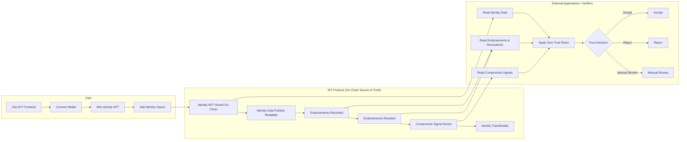

# Mini DIT – User Flow

This document describes the **explicit user flow** exposed by the Mini DIT protocol.

> The frontend reflects **protocol facts only**.  
> Trust interpretation is delegated to external systems.

---

## High-Level Flow Diagram

---

## Architecture Overview

**DIT enables decentralized identity by separating identity facts from trust decisions.**

The protocol consists of three primary actors:

1. **User Actions** - End users creating and managing their identity tokens
2. **DIT Protocol Blockchain Source of Truth** - On-chain storage and verification layer
3. **Verifiers External Applications** - Third-party systems that consume identity data and make trust decisions

---

## 1. User Actions

### Step 1: Visit DIT Frontend
Users access the DIT frontend application to begin the identity creation process.

### Step 2: Connect Wallet
Users connect their Web3 wallet (e.g., MetaMask, WalletConnect) to authenticate and interact with the protocol.

### Step 3: Mint Identity Token NFT
Users mint a new Identity NFT that serves as their on-chain identity anchor. This NFT is:
- Stored on-chain
- Publicly readable
- Transferable between wallets

### Step 4: Add Identity Claims
Users add identity claims to their NFT, such as:
- Personal attributes
- Credentials
- Social profiles
- Other verifiable data

Once created, the **Identity token is created** and ready for endorsements.

---

## 2. DIT Protocol (Blockchain Source of Truth)

The protocol layer records **facts, not trust**. It provides:

### Identity NFT Stored On-Chain
The core identity token exists as an immutable on-chain record.

### Identity Data is Publicly Readable
All identity claims and metadata are publicly accessible for verification.

### Endorsements Issued by Other Identities
Other identity holders can endorse a user's identity, creating a web of attestations.

### Endorsements Recorded On-Chain
All endorsements are permanently recorded to the blockchain.

### Endorsements Can Be Revoked
Endorsers can revoke their endorsements if circumstances change.

### Compromise or Revocation Signal Stored
If an identity is compromised or needs to be invalidated, a signal is stored on-chain.

### Identity Token Can Be Transferred with Rotation
The NFT can be transferred to a new wallet, allowing for key rotation while maintaining identity continuity.

**Key Principle:** The protocol records facts not trust decisions.

---

## 3. Verifiers (External Applications)

External applications consume protocol data and apply their own trust logic:

### Step 1: External Application or Organization Initiates
A third-party application (employer, platform, service provider) wants to verify an identity.

### Step 2: Reads Identity Token Data
The verifier reads the on-chain identity claims and metadata.

### Step 3: Reads Endorsements and Revocation Signals
The verifier checks:
- Who has endorsed this identity
- Whether any endorsements have been revoked
- Whether compromise signals exist

### Step 4: Applies Its Own Trust Rules
The verifier applies its custom trust logic based on:
- Endorsement patterns
- Revocation history
- Compromise signals
- Business requirements

### Step 5: Trust Decision
The verifier makes one of three decisions:

- **Accept** - Identity meets trust criteria
- **Reject** - Identity fails trust criteria
- **Manual Review** - Edge case requiring human judgment

---

## Key Design Principles

### Separation of Concerns
DIT separates **identity facts** (stored on-chain) from **trust interpretation** (handled by verifiers).

### Decentralization
No single authority controls trust decisions. Each verifier defines its own rules.

### Transparency
All identity data, endorsements, and revocations are publicly readable and auditable.

### Flexibility
Verifiers can implement any trust model, from simple endorsement counts to complex graph analysis.

### User Control
Users own their identity NFT and can transfer it between wallets while maintaining history.

---

## Flow Summary

1. **Users** create identity tokens with claims
2. **Protocol** stores identity facts on-chain (data, endorsements, revocations, signals)
3. **Verifiers** read protocol data and apply custom trust rules to make decisions

This architecture enables **decentralized identity** while allowing each application to define what "trust" means in their context.
V5 -->|Manual Review| V8

